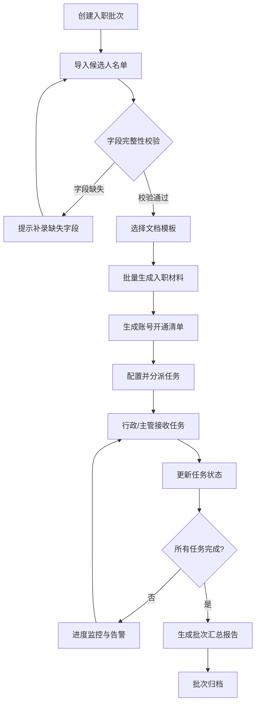

## 1. 产品概述

新员工入职材料自动化工具，专为人力资源团队设计，实现从候选人信息导入到入职材料生成、账号开通、任务分派和进度追踪的全流程自动化。解决传统入职流程中手动填写文档效率低、信息易出错、任务跟进不及时等痛点，显著提升HR团队工作效率和入职体验。

- 目标用户：HR专员、行政人员、各部门直属主管
- 核心价值：批量处理入职流程，减少重复劳动，确保信息一致性，实时追踪任务进度

## 2. 核心功能

### 2.1 用户角色
| 角色 | 使用场景 | 核心权限 |
|------|----------|----------|
| HR专员 | 主导入职全流程 | 导入名单、选择模板、生成材料、分派任务、查看全局进度 |
| 行政人员 | 执行账号开通等任务 | 查看分派任务、更新完成状态、提交完成凭证 |
| 部门主管 | 确认部门事项 | 查看本部门入职人员、确认工位安排、完成状态确认 |

### 2.2 功能模块
1. **名单导入**：Excel/CSV批量导入、手动单条添加、数据校验、缺失字段提示补录
2. **模板填充**：模板库管理（劳动合同、保密协议、设备领用单等）、自动字段映射、批量生成文档、预览与下载
3. **账号清单**：按部门分类展示开通事项（邮箱、门禁、工牌、VPN、系统账号等）、一键生成开通申请单
4. **任务分派**：任务模板配置、按角色自动分派、任务优先级设置、截止日期提醒
5. **结果核对**：批次进度仪表盘、任务状态统计、缺失项告警、导出汇总报告

### 2.3 页面详情
| 页面名称 | 模块名称 | 功能描述 |
|-----------|-------------|---------------------|
| 首页仪表盘 | 批次概览卡片 | 显示进行中批次、待处理任务数、本月入职人数、完成率统计 |
| 首页仪表盘 | 进度时间线 | 可视化展示各批次当前所处阶段和完成进度 |
| 名单导入 | 文件上传区 | 支持拖拽上传Excel/CSV文件，支持模板下载 |
| 名单导入 | 数据预览表格 | 展示导入数据，高亮缺失字段，支持行内编辑 |
| 名单导入 | 字段映射配置 | 将导入列名映射到系统字段（姓名、岗位、入职日期等） |
| 模板填充 | 模板选择区 | 卡片式展示可用模板，支持多选和预览 |
| 模板填充 | 生成进度面板 | 显示批量生成进度，成功/失败数量统计 |
| 模板填充 | 文档下载区 | 按员工分组展示生成的文档，支持单独/批量下载 |
| 账号清单 | 部门分组面板 | 按部门折叠展示员工列表及其需开通的账号 |
| 账号清单 | 事项勾选 | 可勾选具体开通事项，生成部门开通申请单 |
| 任务分派 | 任务模板列表 | 预设任务模板（邮箱申请、工牌制作等），可拖拽排序 |
| 任务分派 | 分派配置面板 | 为任务指定负责人（行政/主管）、截止日期、优先级 |
| 任务分派 | 通知设置 | 配置邮件/站内通知触发条件 |
| 结果核对 | 批次进度列表 | 表格展示所有批次及各阶段完成百分比 |
| 结果核对 | 任务状态统计 | 饼图/柱状图展示待办/进行中/已完成/逾期任务分布 |
| 结果核对 | 缺失项告警区 | 红色高亮显示缺失字段或未完成任务，支持一键跳转处理 |
| 结果核对 | 报告导出 | 生成PDF/Excel格式的入职进度汇总报告 |

## 3. 核心流程

HR专员创建入职批次 → 导入候选人名单（系统自动校验字段完整性）→ 选择所需文档模板并批量生成入职材料 → 按部门生成账号开通清单 → 为行政和部门主管分派各项任务 → 各负责人更新任务完成状态 → HR实时监控进度，处理缺失项和告警 → 全部完成后生成批次汇总报告。

## 4. 用户界面设计

### 4.1 设计风格
- **主色调**：深海蓝 #1e3a5f（专业、可信赖），搭配暖铜色 #d4a574 作为强调色
- **辅助色**：成功绿 #2d8659、警告橙 #e8a33d、错误红 #c75050、信息蓝 #4a90b8
- **背景**：浅灰蓝渐变底色 #f5f7fa → #eef2f7，搭配极细的几何纹理增加质感
- **按钮风格**：圆角8px，微立体效果（微妙阴影+渐变填充），悬停时有轻微上浮动画
- **字体**：标题使用 Noto Serif SC（优雅衬线），正文使用 Noto Sans SC（清晰易读）
- **布局风格**：卡片式布局，左侧垂直步骤导航+右侧主内容区，每个步骤带进度指示圆点
- **图标**：使用 Lucide React 图标库，统一线性风格，大小18px，与文字间距6px
- **动效**：页面切换时使用淡入+滑入组合动画，卡片悬停时阴影加深+上移2px，数据加载时骨架屏过渡

### 4.2 页面设计概述
| 页面名称 | 模块名称 | UI Elements |
|-----------|-------------|-------------|
| 首页仪表盘 | 批次概览卡片 | 渐变背景卡片（深蓝到蓝紫），大号数字指标，底部迷你趋势图，图标使用暖铜色填充 |
| 首页仪表盘 | 进度时间线 | 横向时间轴，节点为圆形带编号，已完成节点填充绿色，当前节点脉冲动画，连接线使用虚线渐变 |
| 名单导入 | 文件上传区 | 大虚线边框区域，深海军蓝底色配白色图标，拖拽进入时边框变实线并发光，显示文件预览缩略图 |
| 名单导入 | 数据预览表格 | 斑马纹行，缺失字段单元格淡红色背景+橙色三角警示标记，表头固定，支持横向滚动 |
| 模板填充 | 模板选择区 | 卡片网格布局，卡片顶部缩略图预览，选中状态深蓝色边框+右上角勾选徽章，悬停放大1.02倍 |
| 账号清单 | 部门分组面板 | 可折叠手风琴组件，部门标题栏带人数徽章，每一行事项带状态切换开关 |
| 任务分派 | 分派配置面板 | 左右分栏布局，左侧任务列表，右侧配置表单，使用时间选择器、下拉选择器等富表单组件 |
| 结果核对 | 批次进度列表 | 每行内嵌水平进度条（渐变填充），状态使用彩色标签，支持按列排序和筛选 |
| 结果核对 | 缺失项告警区 | 顶部固定红色横幅，带白色警告图标，逐条列出缺失项，每项配"立即处理"跳转按钮 |

### 4.3 响应式设计
- **设计优先级**：桌面端优先（HR工作主要在大屏完成），兼顾平板横屏
- **断点设置**：≥1280px 三栏布局，≥960px 双栏布局，＜960px 单栏+抽屉式导航
- **触控优化**：移动端按钮最小点击区域44×44px，表格支持左右滑动浏览，下拉菜单优化触控体验
- **打印适配**：汇总报告页面提供打印友好的样式，去除导航和交互元素

### 4.4 微交互细节
- 步骤切换：当前步骤圆点有持续脉冲光晕效果
- 表单输入：聚焦时输入框边框渐变动画，错误状态抖动效果
- 数据加载：骨架屏采用微光扫过动画（shimmer effect）
- 操作成功：右上角弹出toast通知，带下滑进入+渐隐消失动画
- 批量操作：进度条采用分段式显示，每完成一段有微小弹跳效果
