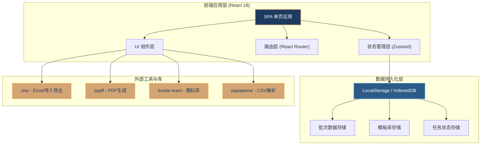
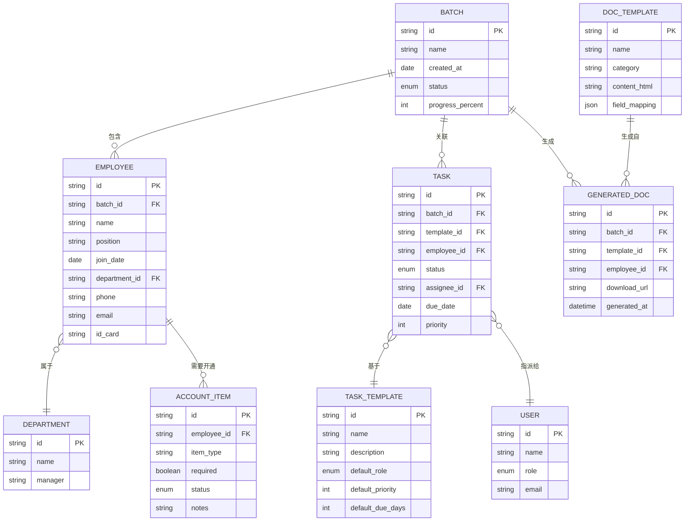

## 1. 架构设计



## 2. 技术描述

- **前端框架**：React@18 + TypeScript@5
- **构建工具**：Vite@5（热更新、快速构建）
- **样式方案**：TailwindCSS@3（原子化CSS）+ PostCSS
- **状态管理**：Zustand@4（轻量级状态管理，替代Redux）
- **路由管理**：React Router@6（Hash路由模式，无需服务器配置）
- **图标库**：lucide-react（统一线性风格图标）
- **Excel处理**：xlsx@0.18 + papaparse@5（CSV解析）
- **文档生成**：jspdf@2 + html2canvas（PDF导出）
- **图表可视化**：recharts@2（进度统计图表）
- **拖拽组件**：@dnd-kit/core（任务拖拽排序）
- **表单处理**：react-hook-form@7（高性能表单校验）
- **后端**：无后端，纯前端单页应用，数据持久化使用LocalStorage + IndexedDB
- **Mock数据**：内置演示数据，首次访问自动填充示例批次和模板

## 3. 路由定义

| 路由路径 | 页面名称 | 功能说明 |
|----------|----------|----------|
| `/` | 首页仪表盘 | 批次概览、全局进度统计、快捷操作入口 |
| `/batches` | 批次列表 | 所有入职批次的增删改查、状态筛选 |
| `/batches/:id/import` | 步骤一：名单导入 | Excel/CSV上传、数据校验、字段映射 |
| `/batches/:id/templates` | 步骤二：模板填充 | 模板选择、批量生成文档、下载 |
| `/batches/:id/accounts` | 步骤三：账号清单 | 部门分组、账号事项配置、申请单生成 |
| `/batches/:id/tasks` | 步骤四：任务分派 | 任务模板配置、负责人指派、通知设置 |
| `/batches/:id/review` | 步骤五：结果核对 | 进度仪表盘、告警处理、报告导出 |
| `/templates` | 模板管理 | 文档模板库的增删改查、预览 |
| `/settings` | 系统设置 | 任务默认配置、通知模板、字段字典 |

## 4. 状态管理与数据流

### 4.1 Store 划分

```typescript
// stores/batchStore.ts - 批次数据存储
interface BatchStore {
  batches: Batch[];
  currentBatchId: string | null;
  createBatch: (data: Partial<Batch>) => Batch;
  updateBatch: (id: string, data: Partial<Batch>) => void;
  deleteBatch: (id: string) => void;
  importEmployees: (batchId: string, employees: Employee[]) => void;
}

// stores/taskStore.ts - 任务管理存储
interface TaskStore {
  tasks: Task[];
  assignTask: (taskId: string, assignee: string, dueDate: Date) => void;
  updateTaskStatus: (taskId: string, status: TaskStatus) => void;
}

// stores/templateStore.ts - 模板库存储
interface TemplateStore {
  templates: DocumentTemplate[];
  selectedTemplateIds: string[];
  generateDocuments: (batchId: string) => GeneratedDoc[];
}

// stores/uiStore.ts - UI交互状态
interface UIStore {
  currentStep: number;
  sidebarCollapsed: boolean;
  notifications: Notification[];
  showToast: (message: string, type: 'success' | 'error' | 'warning') => void;
}
```

### 4.2 数据流原则
- 单向数据流：UI组件 → Action → Store更新 → 订阅组件重渲染
- 批量操作使用immer进行不可变更新
- 关键数据变更自动同步到LocalStorage（debounce 500ms）
- 初始化时从LocalStorage恢复数据，若无数据则加载mock演示数据

## 5. 核心组件架构

```
src/
├── components/
│   ├── layout/
│   │   ├── AppLayout.tsx          # 主布局：侧边栏+内容区
│   │   ├── StepNavigation.tsx     # 步骤导航组件（垂直步骤条）
│   │   ├── DashboardLayout.tsx    # 仪表盘专用布局
│   │   └── TopNavbar.tsx          # 顶部导航栏
│   ├── batch/
│   │   ├── BatchCard.tsx          # 批次概览卡片
│   │   ├── ProgressTimeline.tsx   # 进度时间线
│   │   └── BatchTable.tsx         # 批次列表表格
│   ├── import/
│   │   ├── FileUploader.tsx       # 文件拖拽上传区
│   │   ├── DataPreviewTable.tsx   # 数据预览表格（可编辑）
│   │   ├── FieldMapper.tsx        # 字段映射配置器
│   │   └── MissingFieldsAlert.tsx # 缺失字段告警
│   ├── templates/
│   │   ├── TemplateCard.tsx       # 模板选择卡片
│   │   ├── DocPreviewModal.tsx    # 文档预览弹窗
│   │   ├── GenerateProgress.tsx   # 生成进度面板
│   │   └── DownloadSection.tsx    # 文档下载区
│   ├── accounts/
│   │   ├── DepartmentAccordion.tsx # 部门手风琴面板
│   │   ├── AccountItemToggle.tsx   # 账号事项开关
│   │   └── ApplicationForm.tsx     # 开通申请单生成器
│   ├── tasks/
│   │   ├── TaskTemplateList.tsx   # 任务模板列表（可拖拽）
│   │   ├── AssignmentForm.tsx     # 分派配置表单
│   │   ├── AssigneeSelector.tsx   # 负责人选择器
│   │   └── TaskStatusTag.tsx      # 任务状态标签
│   ├── review/
│   │   ├── BatchProgressBar.tsx   # 批次进度条
│   │   ├── StatusCharts.tsx       # 状态统计图表
│   │   ├── AlertBanner.tsx        # 缺失项告警横幅
│   │   └── ReportExporter.tsx     # 报告导出组件
│   └── common/
│       ├── Button.tsx             # 通用按钮
│       ├── Input.tsx              # 通用输入框
│       ├── Modal.tsx              # 通用弹窗
│       ├── Toast.tsx              # Toast通知
│       ├── EmptyState.tsx         # 空状态
│       └── Skeleton.tsx           # 骨架屏
├── pages/
│   ├── DashboardPage.tsx
│   ├── BatchListPage.tsx
│   ├── ImportStepPage.tsx
│   ├── TemplateStepPage.tsx
│   ├── AccountsStepPage.tsx
│   ├── TasksStepPage.tsx
│   ├── ReviewStepPage.tsx
│   ├── TemplateManagePage.tsx
│   └── SettingsPage.tsx
├── stores/
│   ├── batchStore.ts
│   ├── taskStore.ts
│   ├── templateStore.ts
│   └── uiStore.ts
├── types/
│   └── index.ts                   # 全局TypeScript类型定义
├── utils/
│   ├── excelParser.ts             # Excel/CSV解析工具
│   ├── docGenerator.ts            # 文档生成工具
│   ├── pdfExporter.ts             # PDF导出工具
│   ├── storage.ts                 # LocalStorage封装
│   ├── validator.ts               # 数据校验工具
│   └── mockData.ts                # 演示数据生成器
└── App.tsx
```

## 6. 数据模型

### 6.1 ER关系图



### 6.2 核心TypeScript类型定义

```typescript
// 批次状态
type BatchStatus = 'draft' | 'importing' | 'processing' | 'in_progress' | 'completed' | 'archived';

// 任务状态
type TaskStatus = 'pending' | 'in_progress' | 'completed' | 'overdue' | 'cancelled';

// 任务优先级
type TaskPriority = 'low' | 'medium' | 'high' | 'urgent';

// 用户角色
type UserRole = 'hr' | 'admin' | 'manager';

// 账号类型
type AccountType = 'email' | 'access_card' | 'id_badge' | 'vpn' | 'erp' | 'oa' | 'other';

interface Batch {
  id: string;
  name: string;
  createdAt: string;
  status: BatchStatus;
  currentStep: number;
  progressPercent: number;
  employeeCount: number;
  completedTaskCount: number;
  totalTaskCount: number;
  startDate: string;
  notes?: string;
}

interface Employee {
  id: string;
  batchId: string;
  name: string;
  position: string;
  joinDate: string;
  departmentId: string;
  departmentName: string;
  phone?: string;
  email?: string;
  idCard?: string;
  gender?: 'male' | 'female';
  managerId?: string;
  managerName?: string;
  workstation?: string;
  _missingFields?: string[];
}

interface Department {
  id: string;
  name: string;
  managerName: string;
  managerEmail: string;
  employeeCount: number;
}

interface DocumentTemplate {
  id: string;
  name: string;
  category: 'contract' | 'agreement' | 'equipment' | 'other';
  description: string;
  thumbnail: string;
  requiredFields: string[];
  contentTemplate: string;
  isSelected?: boolean;
}

interface Task {
  id: string;
  batchId: string;
  templateId: string;
  title: string;
  description: string;
  employeeIds: string[];
  assigneeId: string;
  assigneeName: string;
  assigneeRole: UserRole;
  status: TaskStatus;
  priority: TaskPriority;
  dueDate: string;
  createdAt: string;
  completedAt?: string;
  notes?: string;
}

interface GeneratedDocument {
  id: string;
  batchId: string;
  templateId: string;
  templateName: string;
  employeeId: string;
  employeeName: string;
  fileUrl: string;
  fileSize: number;
  generatedAt: string;
}

interface AccountItem {
  id: string;
  employeeId: string;
  type: AccountType;
  typeName: string;
  required: boolean;
  status: 'pending' | 'applying' | 'completed';
  applicant?: string;
  completedAt?: string;
  notes?: string;
}

interface Notification {
  id: string;
  type: 'success' | 'error' | 'warning' | 'info';
  message: string;
  timestamp: string;
  read: boolean;
}
```

### 6.3 初始Mock数据说明

首次加载时，系统自动生成：
- 3个示例部门（技术部、市场部、人事部）
- 5个文档模板（劳动合同、保密协议、竞业限制、设备领用单、入职须知）
- 8个任务模板（开通邮箱、制作工牌、申请门禁、配置VPN、工位安排、设备发放、系统权限开通、入职培训安排）
- 2个示例批次：一个处于"名单导入"阶段（含5名员工，含2个缺失字段告警），一个处于"任务分派"阶段（含8名员工，部分任务已完成）
